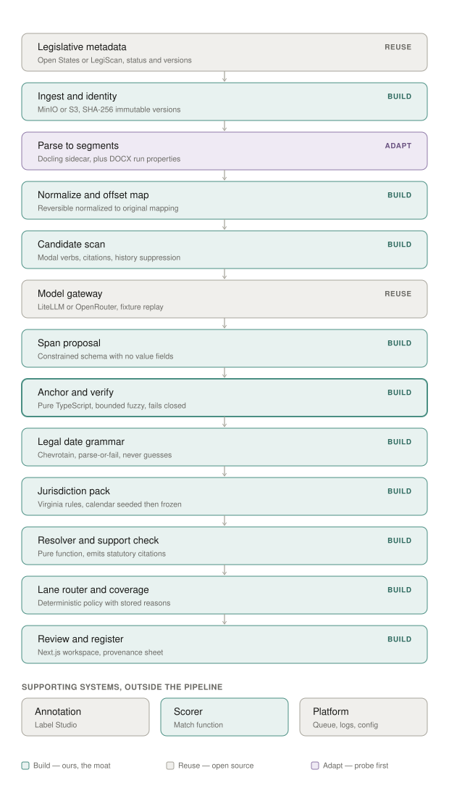

# PolicyAction — Open Source Reuse Analysis

**Date:** August 3, 2026
**Purpose:** determine, component by component, what to reuse and what to build. Append to the Claude Code implementation prompt as a binding constraint.

---

## The rule

Reuse anything that is a commodity. Build only what is either (a) the moat, or (b) legally load-bearing in a way that a general-purpose library cannot satisfy.

**One trap specific to this product.** Most open-source text and date libraries are built to be *permissive* — they return a best guess rather than refusing. That is the correct default for search, RAG, and analytics, and it is exactly wrong here. Adopting a permissive component anywhere in the resolution path silently destroys the parse-or-fail property that makes the output defensible.

So the reuse question is not only "does this exist?" It is: **does this component refuse when it is unsure?** If it guesses, it can be used for candidate discovery but never for resolution.

---

## Component map

The distribution is the finding. **Reuse clusters at the edges; build sits in the middle.** Everything at the boundaries — where documents arrive, where models are called, where annotators work, where jobs queue — is commodity, and someone has solved it better than we will. The unbroken run from *anchor and verify* through *lane router* is what nobody has open-sourced, because it requires knowing Virginia law and refusing to guess.

Three labels carry most of the decision weight:

- **Legislative metadata — REUSE.** Open States supplies bill status, session, version links, and action history for Virginia and DC alike. It removes the scraping work and fills the `legislativeStatus` gap that would otherwise allow a dead bill's deadlines onto a calendar.
- **Parse to segments — ADAPT.** The only conditional box. Docling is MIT and ships a REST wrapper, but adoption depends on two verifications (see §"Two probes" below). Pass, and this shrinks to an adapter; fail, and it is real work.
- **Scorer — BUILD**, despite sitting among borrowed supporting systems. Every accuracy claim the product makes rests on it.

---

## Tier 1 — Reuse. These are solved.

### Legislative metadata and bill identity → Open States / Plural

The single biggest finding. <cite index="14-1">Open States provides a JSON API for programmatic access to state legislative information</cite>, and <cite index="15-1">aggregates legislative information from all 50 states, Washington, D.C., and Puerto Rico, standardized and cleaned, published via an API and bulk downloads</cite>. Available output includes <cite index="11-1">bill metadata, primary sponsors, legislative action history, vote records, and bill text version links</cite>, filterable <cite index="11-1">by jurisdiction, session, subject tag, bill type, full-text keyword, or last-updated date</cite>. <cite index="16-1">Bulk JSON files representing all bills and votes are available per session and include full text.</cite>

**This supplies most of Module 1.** `legalIdentity`, `legislativeStatus`, `authoritativeSource`, `asOfDate`, and version links — the fields ChatGPT correctly identified as missing — come from here rather than from parsing. It also covers Virginia *and* DC in one integration, which materially changes the jurisdiction sequencing question.

Caveats: <cite index="18-1">the project was adopted by Plural in 2021</cite> and <cite index="19-1">Open States is now Plural / SAI360, with the legacy site existing primarily for API key registration</cite>. So this is a commercial dependency with an open-data commitment, not a community project. <cite index="11-1">The free tier allows roughly 30 requests per minute</cite>, which argues for bulk downloads plus delta polling rather than live queries. <cite index="20-1">LegiScan is the alternative, providing structured JSON for all 50 states and Congress including bill texts, status, and sponsors</cite> — evaluate both, and abstract behind a `LegislativeMetadataSource` interface so neither is load-bearing.

**Do not build a scraper.** Derive legislative status from the action history rather than inferring it.

### Document parsing → Docling

<cite index="36-1">MIT licensed, hosted by the LF AI & Data Foundation, originating from IBM Research Zurich.</cite> <cite index="38-1">It parses PDF, DOCX, PPTX, XLSX, HTML, EPUB and images into a unified DoclingDocument representation, with advanced PDF understanding including page layout, reading order, and table structure, plus lossless JSON export and local execution for sensitive or air-gapped environments.</cite> <cite index="43-1">The `docling-serve` repository provides FastAPI wrappers for running Docling as a REST API</cite> — **your Python sidecar is already built.**

**Two things must be verified before adopting, and they are gating.** Docling's outputs are optimized for LLM and RAG consumption, which is a different requirement than yours. Confirm on real Virginia bills:

1. **Does the lossless JSON export preserve character offsets into the original text?** Without them, evidence anchoring cannot be built on top of it and you must post-process against the raw source.
2. **Does the DOCX backend preserve run-level formatting — strikethrough and italics?** If it normalizes them away, Docling handles everything *except* amendment status, and you read `w:rPr` yourself for that one signal.

If both pass, Module 2 collapses to a thin adapter. If either fails, use Docling for PDF and structure while reading DOCX OOXML directly. **Never use its markdown export** — markdown has no offsets.

### Annotation tooling → Label Studio or doccano

Do not build an annotation UI. <cite index="26-1">Label Studio is Apache 2.0, which allows free commercial use, and the community edition includes core annotation features, project management, and export</cite>. <cite index="26-1">doccano is MIT licensed, text-focused, and the most lightweight option, supporting NER, classification, and relation extraction with no configuration files required</cite>. <cite index="24-1">doccano provides a REST API for programmatic upload, annotation export, and importing model predictions for pre-labelling, and ships Docker images.</cite>

**Critical gap you must fill yourself.** <cite index="27-1">Label Studio's community edition ships no inter-annotator agreement metrics at all; ground truth marking and quality dashboards start at $99 per user per month.</cite> <cite index="24-1">doccano's quality control is basic, with no built-in adjudication UI or IAA dashboard — teams typically do dual annotation and compute agreement externally.</cite>

Since IAA is a Gate 0 criterion, compute it yourself: `krippendorff` or `scikit-learn`'s `cohen_kappa_score` over exported JSON. Roughly fifty lines. Do not pay for the enterprise tier to get it.

One workflow warning that the tooling makes easy and your design forbids: <cite index="24-1">importing model predictions for pre-labelling reduces annotation time substantially</cite> — but for **holdout** gold this is annotation-by-correction and produces anchored, inflated labels. Pre-labelling is acceptable on the development set only.

### Holiday calendars → `holidays` (vacanza), as a seed

<cite index="46-1">A fast library generating country- and subdivision-specific sets of government-designated holidays</cite>, with <cite index="48-1">US state support including VA and DC</cite>.

**Use it to generate the initial calendar, then own the output as versioned pack data.** Two reasons this cannot be a live dependency: § 1-210(E) turns on legal holidays *and* days the relevant government office is closed, which is broader than a public-holiday list; and a resolution performed today must be reproducible in 2029, which a library upgrade would break. Generate, reconcile against the Virginia statutory holiday list, freeze as JSON, version it.

Verified in Module 7. The library was incomplete for Virginia in 34 entries across 7 holidays over 2024–2035 — most significantly "Day after Thanksgiving" (absent in all 12 years) and 16 observed-date substitutes that the library filters out for VA. Both categories are exactly what § 1-210(E) rollover depends on, so using the library output unmodified would have produced wrong deadlines.

This confirms the "seed then freeze" decision: the library is a starting point requiring statutory reconciliation, never a source of truth. Expect the same for any future jurisdiction.

### Commodity infrastructure — reuse without discussion

`rapidfuzz` or `fastest-levenshtein` for bounded fuzzy anchoring. Chevrotain for the date grammar. `pg-boss` or `graphile-worker` for the durable queue. MinIO for S3-compatible local storage. Drizzle plus a migration tool. Zod for environment and schema validation. Pino for structured logging. Testcontainers for integration tests.

---

## Tier 2 — Evaluate, with reservations

### LLM evaluation tooling → use for prompt regression only

<cite index="29-1">DeepEval is Apache 2.0, Python-native, built on pytest, with 50+ built-in metrics</cite>. <cite index="32-1">Promptfoo's core is MIT licensed, with YAML-defined test cases supporting exact match, regex, JSON schema validation, cost thresholds, latency limits, and custom assertion functions in JavaScript or Python, and CI integration that fails builds on regression.</cite>

**Note the ownership change.** <cite index="28-1">OpenAI acquired Promptfoo on March 9 for $86 million; the team says it will stay vendor-neutral</cite>, and <cite index="33-1">has committed to keeping the core MIT-licensed and model-agnostic, though teams evaluating it long-term should watch how that independence holds.</cite> Since your model choice is deliberately provider-agnostic and possibly self-hosted, weigh that.

**These tools cannot do the thing that matters.** None can implement your gold-to-proposal match function, per-lane confusion decomposition, or fabrication counting with a separate denominator — that is domain logic. Use promptfoo or DeepEval for prompt-and-model bake-off and CI regression on prompt changes. **Build the scorer yourself, as specified in Module 12.**

### Legal NLP → LexNLP: do not adopt

Capability-wise it looks like a fit — <cite index="3-1">extraction of dates, recurring dates, and durations; conditional statements and constraints; courts, regulations, and citations; a sentence parser aware of legal abbreviations; and hundreds of unit tests from real legal documents</cite>.

**Two blockers.**

*Licensing.* <cite index="7-1">LexNLP is available by default under the terms of the GNU Affero General Public License v3.0</cite>, with <cite index="10-1">a dual-licensing model requiring contact for release from AGPLv3 terms</cite>. AGPL over a network service is a serious constraint for commercial SaaS. Purchasing a commercial license is possible; taking the AGPL dependency casually is not.

*Behavior.* Its extractors are built to find candidates broadly, not to refuse. That makes them acceptable for Module 3 candidate discovery and unacceptable anywhere near resolution.

*Staleness.* <cite index="7-1">Documentation is at version 2.3.0 dated March 2023.</cite>

**Recommendation:** do not take the dependency. Its published feature list is useful as a checklist of legal-text phenomena you should have fixtures for.

---

## Tier 3 — Build. Do not look for a library.

These are either the moat or legally load-bearing. A general-purpose implementation is worse than none, because it produces confident output where you need refusal.

**Anchoring and verification.** ~300 lines. No library refuses correctly — they all return a best match. The fail-closed behavior *is* the component.

**The legal date grammar.** General date parsers (`chrono`, `dateparser`, and LexNLP's extractors) are permissive by design. `chrono` will parse almost anything into something. Your requirement is the opposite: refuse everything outside the grammar. Chevrotain is the tool; the grammar is yours.

**Jurisdiction packs.** § 1-214 branch logic, § 1-210 computation, the reconciled holiday calendar, rule IDs and citations. Nothing open-source encodes state statutory time computation, and this is the asset a competitor cannot copy.

**Lane router and coverage accounting.** Product logic.

**Match function and scorer.** Domain logic and the basis of every accuracy claim.

**The corpus and annotation guide.** Not software.

---

## What this changes in the build plan

| Module | Change |
|---|---|
| 1 — Ingestion | Add `LegislativeMetadataSource` adapter over Open States or LegiScan. Do not derive status by parsing. |
| 2 — Parsing | **Probe Docling first** — offsets and DOCX run properties. Adapter, not implementation, if it passes. |
| 3 — Candidate scan | Permissive libraries are acceptable *here only*. Document that anything they produce is a candidate, never a value. |
| 7 — Jurisdiction pack | Seed the calendar from `holidays`, then freeze and version. Not a runtime dependency. |
| 12 — Eval | Scorer stays custom. Add promptfoo or DeepEval for prompt regression in CI. |
| New — Annotation | Deploy Label Studio or doccano. Write the IAA script. Do not build a UI. |

**Licensing policy to add to the Claude Code prompt:** permitted licenses are MIT, Apache 2.0, BSD, and ISC. AGPL and SSPL require explicit approval before adoption. Every new dependency is recorded with its license in the module report.

---

## Two probes to run before Module 2

Both are afternoons, and both can eliminate weeks.

1. **Virginia LIS format.** What does it actually serve for a target bill — structured XML, DOCX, or PDF only? Determines whether amendment status is declared or inferred.
2. **Docling fidelity.** Run a real Virginia bill through Docling in both DOCX and PDF. Does the JSON carry character offsets? Does the DOCX backend preserve strikethrough and italics? Determines whether Module 2 is an adapter or an implementation.

Run these before Claude Code starts Module 2. They are the two highest-leverage unknowns remaining.
